# Clinical Trials Analysis
## Phase Completion Rates, Sponsor Performance and Recruitment Trends | January 2015 to December 2024

---

## Project Overview
This project examined 10 years of clinical trial activity across major pharmaceutical sponsors using 50,000 interventional trial records retrieved from the ClinicalTrials.gov API. The analysis covered all therapeutic areas with focus on oncology, cardiovascular, respiratory and vaccines, examining phase completion rates, sponsor performance profiles, recruitment trends and trial duration patterns across 2015 to 2024.

---

## Objectives
- Analyse the distribution of clinical trials across phases.
- Assess completion and termination rates by phase.
- Identify the most active sponsors and their performance profiles.
- Identify which therapeutic areas had the most trial activity.
- Track how trial activity changed over 10 years from 2015 to 2024.
- Measure average trial durations by phase and therapeutic area.
- Assess recruitment target sizes by phase and therapeutic area.
- Compare oncology, cardiovascular, respiratory and vaccine trial volumes.
- Identify which therapeutic areas had the highest termination rates.
- Analyse sponsor concentration by therapeutic area.
- Execute SQL analytical queries against a PostgreSQL database.
- Present key findings in an interactive Power BI dashboard.

---

## Data Source
| | |
|---|---|
| **Publisher** | ClinicalTrials.gov |
| **Dataset** | Interventional Clinical Trials Registry |
| **Access** | ClinicalTrials.gov API v2 |
| **Coverage** | January 2015 to December 2024 |
| **Records** | 50,000 interventional trial records |
| **Frequency** | Continuously updated |
| **Licence** | Public domain |

---

## Tools and Libraries
| Tool | Purpose |
|---|---|
| Python 3.12 | Core programming language |
| pandas | Data manipulation and transformation |
| numpy | Numerical calculations |
| matplotlib | Data visualisation |
| seaborn | Statistical visualisation and heatmaps |
| requests | ClinicalTrials.gov API data retrieval |
| SQLAlchemy | Python to PostgreSQL connection |
| psycopg2 | PostgreSQL database adapter |
| PostgreSQL 16 | Database storage and SQL analysis |
| Jupyter Lab | Interactive analysis environment |
| Power BI Desktop | Interactive dashboard |
| Git | Version control |

---

## Key Findings

### Dataset Overview
50,000 interventional clinical trial records were retrieved from the ClinicalTrials.gov API covering January 2015 to December 2024. The dataset covered 11,316 unique sponsors across 17 therapeutic areas. 78.3% of trials were completed, 8.8% were terminated and 4.8% were withdrawn. Academic sponsors accounted for 46.4% of all trial registrations and large pharmaceutical companies for 12.7%.

### Phase Distribution and Pipeline Structure
Phase 1 and Phase 2 trials accounted for 34.5% and 31.0% of phased trials respectively. The phase transition analysis identified Phase 2 to Phase 3 as the point of highest attrition with 54.2% of Phase 2 trials progressing to Phase 3. Phase 1 to Phase 2 transition was 89.9% and Phase 3 to Phase 4 was 84.4%. This finding was consistent across both the initial exploratory sample and the full 50,000 record dataset.

### Trial Status and Completion
The overall completion rate was 78.3%. Academic sponsors recorded the highest completion rate at 81.4% and the lowest termination rate at 6.1%. Large pharmaceutical and biotech sponsors recorded the highest termination rates at 12.1% each. Completion rates declined from 84.3% in 2015 to 70.1% in 2024, a reduction of 14.2 percentage points over the 10 year period.

### Sponsor Activity
Cairo University was the most active sponsor with 367 registered trials. Among pharmaceutical sponsors Pfizer registered 243 trials, GlaxoSmithKline 225 and AstraZeneca 220. The sponsor concentration analysis identified the following therapeutic area focus profiles. AstraZeneca registered 44.0% of its trials in oncology and 24.0% in respiratory. GlaxoSmithKline registered 43.4% in respiratory. Pfizer registered 37.1% in oncology and 22.7% in vaccines. Eli Lilly registered 41.0% in metabolic and endocrine disease.

### Therapeutic Area Analysis
Oncology was the most active therapeutic area accounting for 13.9% of all trials and 21.8% of classified trials. Oncology recorded the highest termination rate at 17.7% and the highest overall attrition rate at 24.9%. Oral Health recorded the lowest termination rate at 2.5% and Healthy Volunteer Studies the lowest attrition rate at 5.7%.

### Trial Duration
Phase 2 trials recorded the longest average duration at 31.1 months followed by Phase 3 at 29.4 months. Phase 1 trials recorded the shortest average duration at 20.7 months. Median durations were consistently lower than mean durations across all phases.

### Trial Activity Trend
Trial registrations increased from 1,724 in 2015 to a peak of 5,783 in 2021. Registrations declined in each of the three subsequent years reaching 3,586 in 2024. Vaccine trial registrations increased from 65 in 2019 to 377 in 2020. Completion rates declined from 84.3% in 2015 to 70.1% in 2024.

### Enrollment
Phase 3 trials recorded the largest average enrollment at 362 participants. Infectious Disease trials recorded the highest average enrollment by therapeutic area at 268 participants followed by Vaccines at 262. Total planned enrollment across the full dataset was 28,933,574 participants.

---

## Analyses
| Analysis | Description |
|---|---|
| 1 | Trial distribution by phase |
| 2 | Trial status distribution |
| 3 | Trial distribution by therapeutic area |
| 4 | Completion and termination rates by phase |
| 5 | Top 20 most active sponsors |
| 6 | Trial activity trend by year 2015 to 2024 |
| 7 | Average trial duration by phase |
| 8 | Enrollment size by phase and therapeutic area |
| 9 | Termination rates by therapeutic area |
| 10 | Phase transition funnel |
| 11 | Sponsor concentration by therapeutic area |
| 12 | Therapeutic area trend over 10 years |
| 13 | Summary scorecard |

---

## SQL Queries
| Query | Description |
|---|---|
| 1 | Total trials and status distribution |
| 2 | Completion and termination rates by phase |
| 3 | Top 20 most active sponsors |
| 4 | Sponsor completion rates minimum 10 trials |
| 5 | Trial distribution by therapeutic area |
| 6 | Termination and attrition rates by therapeutic area |
| 7 | Average trial duration by phase |
| 8 | Annual trial registration trend |
| 9 | Phase transition analysis using LAG window function |
| 10 | Comprehensive summary scorecard |

---

## How to Run

### Prerequisites
- Python 3.8 or higher
- PostgreSQL 14 or higher
- Power BI Desktop — powerbi.microsoft.com/desktop
- Jupyter Lab

### 1. Clone the Repository
```bash
git clone git@github.com:Kingsley-Eboh/clinical-trials-analysis.git
cd clinical-trials-analysis
```

### 2. Install Dependencies
```bash
pip install pandas numpy matplotlib seaborn requests sqlalchemy psycopg2-binary jupyter
```

### 3. Set Up PostgreSQL
Create a local PostgreSQL database named clinical_trials. Update the connection string in the Section 6 database load cell with your credentials before running.

### 4. Run the Notebook
Launch Jupyter Lab and open clinical_trials_analysis.ipynb:
```bash
jupyter lab
```
Select Kernel then Restart and Run All Cells to execute all cells in sequence.

### 5. Run the SQL Queries
Once the database is populated execute the analytical queries:
```bash
psql -U your_user -d clinical_trials -h localhost -f sql/clinical_trials_queries.sql
```

### 6. Open the Power BI Dashboard
Open powerbi/clinical_trials_dashboard.pbix in Power BI Desktop and update the CSV file paths to point to your local powerbi folder when prompted.

---

## Evidence

### Analysis 1 — Trial Distribution by Phase
[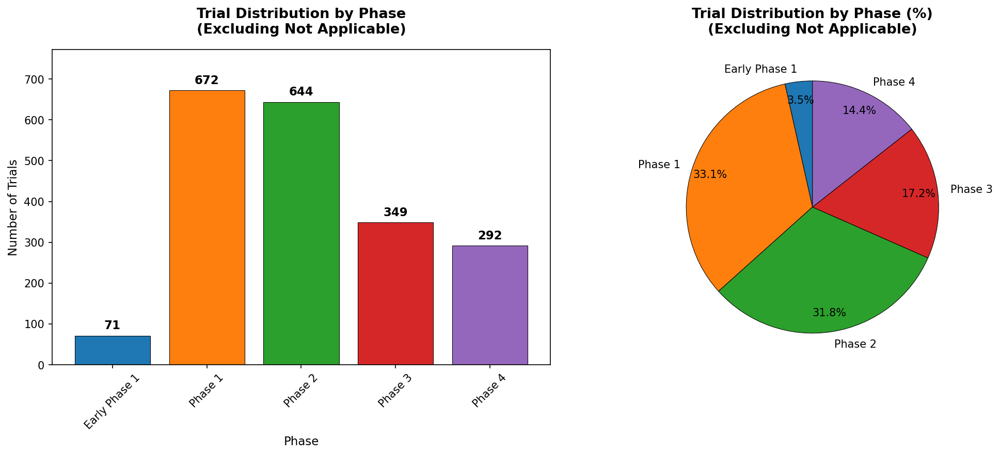](figures/analysis1_trial_distribution_by_phase.png)

### Analysis 2 — Trial Status Distribution
[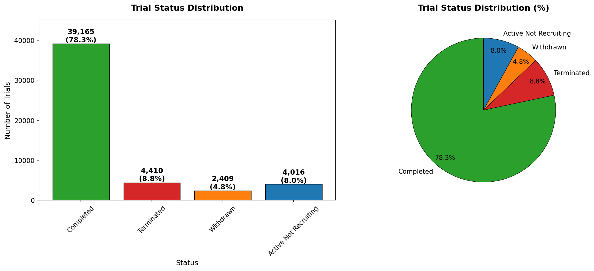](figures/analysis2_trial_status_distribution.png)

### Analysis 3 — Trial Distribution by Therapeutic Area
[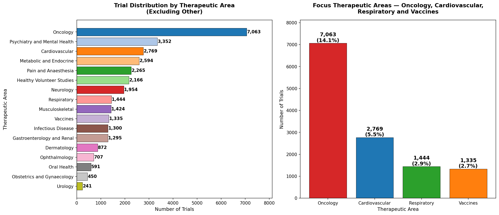](figures/analysis3_trial_distribution_by_therapeutic_area.png)

### Analysis 4 — Completion and Termination Rates by Phase
[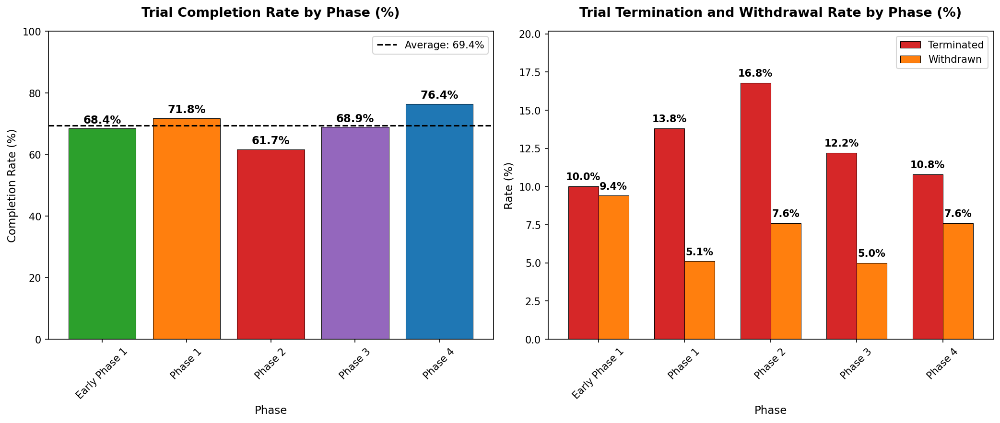](figures/analysis4_completion_termination_by_phase.png)

### Analysis 5 — Top 20 Most Active Sponsors
[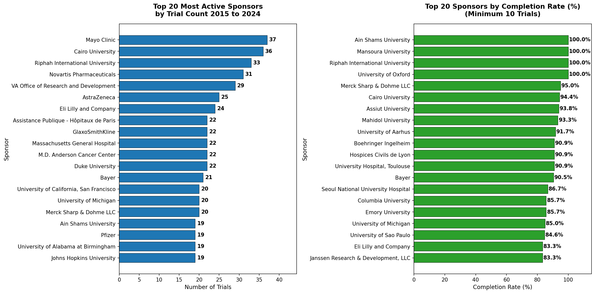](figures/analysis5_top_sponsors.png)

### Analysis 6 — Trial Activity Trend by Year
[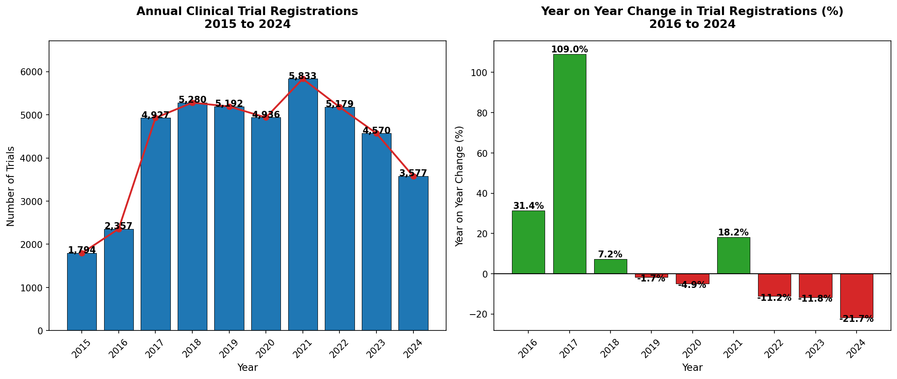](figures/analysis6_trial_activity_trend.png)

### Analysis 7 — Average Trial Duration by Phase
[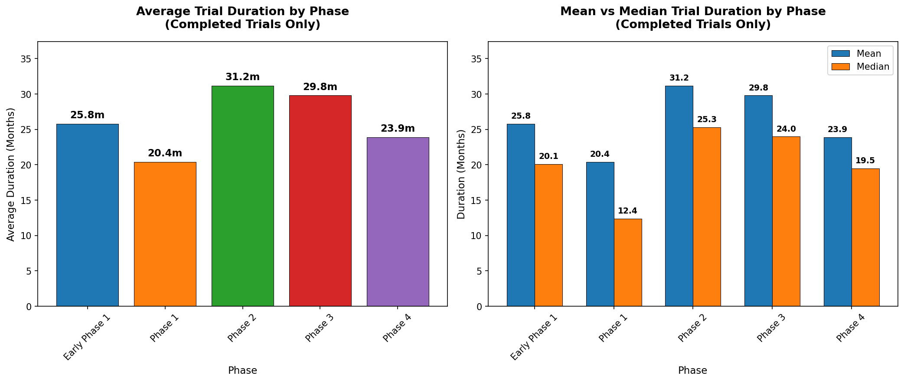](figures/analysis7_trial_duration_by_phase.png)

### Analysis 8 — Enrollment Size by Phase and Therapeutic Area
[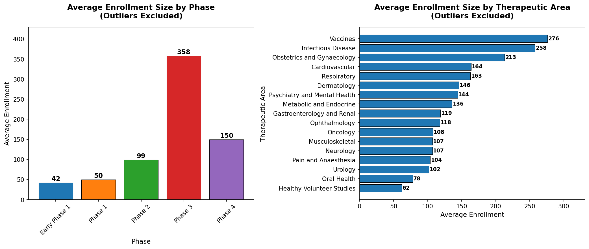](figures/analysis8_enrollment_by_phase_therapeutic_area.png)

### Analysis 9 — Termination Rates by Therapeutic Area
[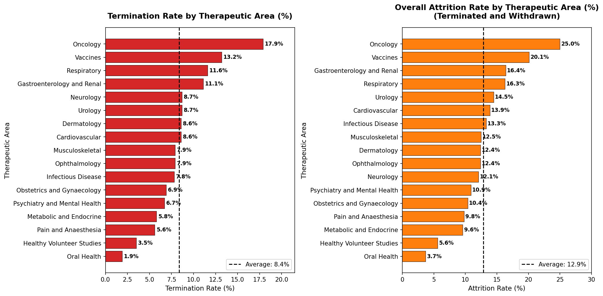](figures/analysis9_termination_by_therapeutic_area.png)

### Analysis 10 — Phase Transition Funnel
[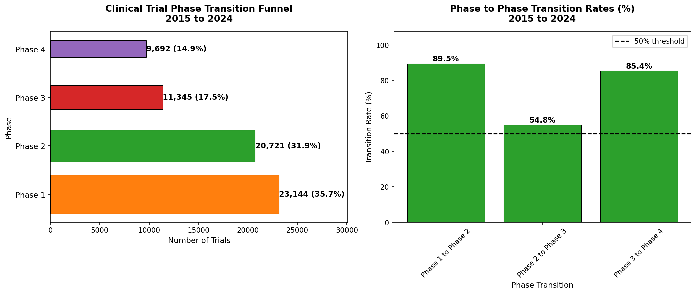](figures/analysis10_phase_transition_funnel.png)

### Analysis 11 — Sponsor Concentration by Therapeutic Area
[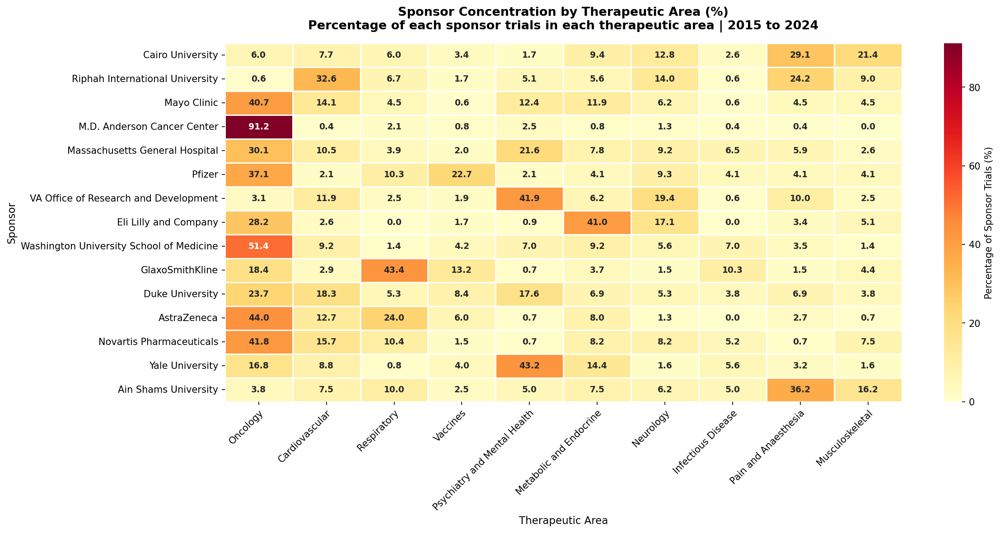](figures/analysis11_sponsor_therapeutic_area_concentration.png)

### Analysis 12 — Therapeutic Area Trend Over 10 Years
[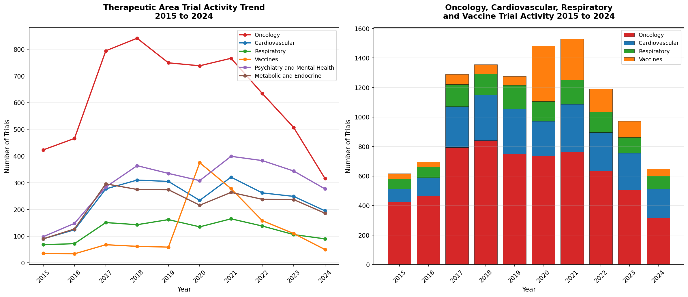](figures/analysis12_therapeutic_area_trend.png)

### Analysis 13 — Summary Scorecard
[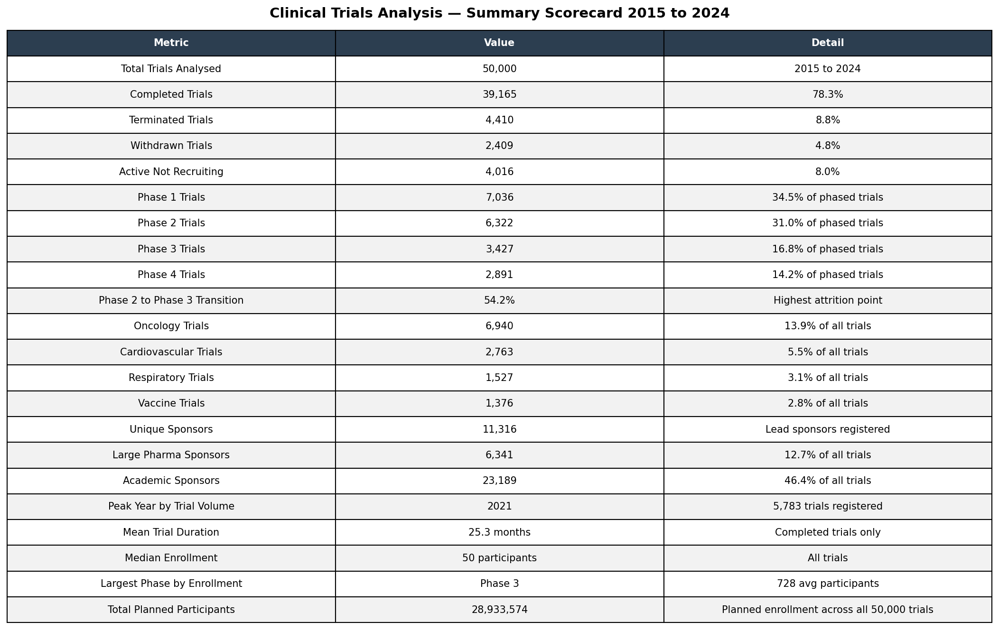](figures/analysis13_summary_scorecard.png)

### Power BI Dashboard — Page 1 — Pipeline and Phase Analysis
[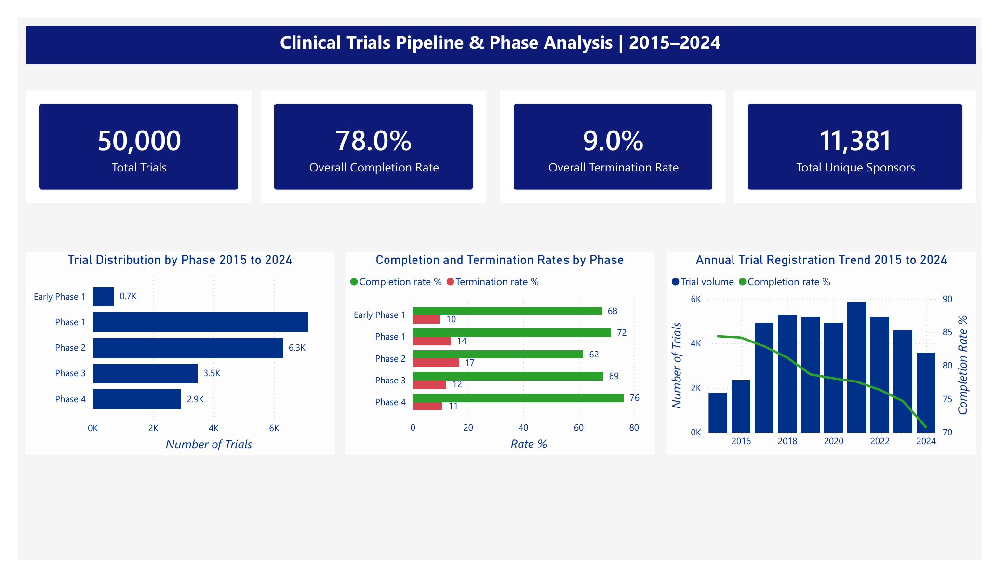](powerbi/dashboard_page1_pipeline_phase_analysis.png)

### Power BI Dashboard — Page 2 — Sponsor and Therapeutic Area Analysis
[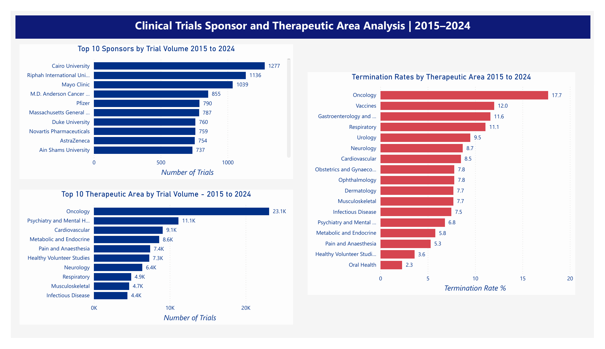](powerbi/dashboard_page2_sponsor_therapeutic_area.png)

---

## Project Structure
```
clinical-trials-analysis/
├── clinical_trials_analysis.ipynb
├── figures/
│   ├── analysis01_trial_distribution_by_phase.png
│   ├── analysis02_trial_status_distribution.png
│   ├── analysis03_trial_distribution_by_therapeutic_area.png
│   ├── analysis04_completion_termination_by_phase.png
│   ├── analysis05_top_sponsors.png
│   ├── analysis06_trial_activity_trend.png
│   ├── analysis07_trial_duration_by_phase.png
│   ├── analysis08_enrollment_by_phase_therapeutic_area.png
│   ├── analysis09_termination_by_therapeutic_area.png
│   ├── analysis10_phase_transition_funnel.png
│   ├── analysis11_sponsor_therapeutic_area_concentration.png
│   ├── analysis12_therapeutic_area_trend.png
│   └── analysis13_summary_scorecard.png
├── sql/
│   └── clinical_trials_queries.sql
├── powerbi/
│   ├── clinical_trials_dashboard.pbix
│   ├── phase_summary.csv
│   ├── sponsor_summary.csv
│   ├── therapeutic_area_summary.csv
│   └── annual_summary.csv
├── .gitignore
└── README.md
```

---

## Author
**Kingsley Eboh**
[GitHub](https://github.com/Kingsley-Eboh)

*Data sourced from ClinicalTrials.gov via the public API. This project is intended for portfolio and educational purposes.*
